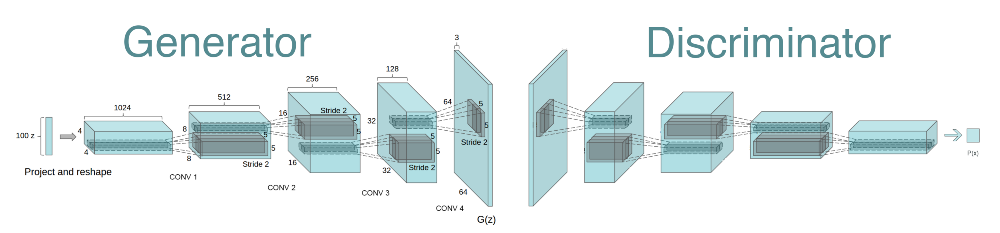

# DCGAN
This is the implementation of DCGAN
The implentation follows the instrcutions from [original DCGAN paper](https://arxiv.org/pdf/1511.06434.pdf) by Alec Radford & Luke Metz, Soumith Chintala

### Dataset
This network is trained on the image dataset [CelebFaces Attributes Dataset (CelebA)](http://mmlab.ie.cuhk.edu.hk/projects/CelebA.html). But feel free to use your own dataset to create a DCGAN!

### Background
DCGAN consists of a generator and a discriminator, where the two parts are both constructed by convolutional neural networks(CNN). The generator takes in a latent vector z, then construct a fake image through series of deconvolution. The discriminator takes in an image(real and fake), then assign a score to the image to indicate whether or not it thinks the image is real or fake.

### DCGAN Structure

### File Introduction
* model.py: The model structure
* loss_fun.py: The loss function
* util.py: Some functions that have been used throughout the building of DCGAN
* train.py: The training step of DCGAN
* run.py: Run this file to train your own DCGAN. You have to specify your own dataset's directory
* images: ressources to share
* train_samples.pkl: images generated by DCGAN

### Loss over 20 epochs

### sample generated images

### Special Thanks to Udacity deep learning Nanodegree Program
This is the project offered by Udacity. The code is mostly written by myself, except some useful image visualization functions.  
